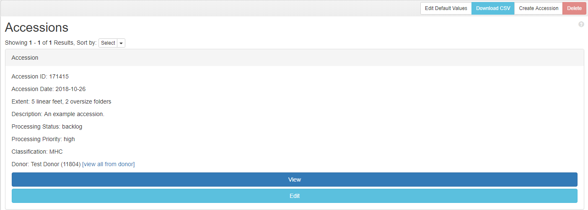

# BHL Accession Search
This plugin displays customized search results for Accession records in ArchivesSpace.

## Directory Structure
    frontend/
        locales/
            en.yml
        views/
            accessions/
                search/
                    _listing.html.erb
                index.html.erb
        plugin_init.rb
    indexer/
        accession_search_indexer.rb

## How It Works
### frontend
The bulk of the functionality of this plugin is handled in `frontend/views/accessions/search/_listing.html.erb`. This template redefines the default ArchivesSpace shared search listing template, currently defined in `archivesspace/frontend/app/views/search/_listing.html.erb`. The customized template displays a panel for each accession with detailed metadata, whereas the default template displays a table with a row for each accession with minimal metadata. The custom listing displays the following information for each accession:

* Accession ID
* Accession Date
* Extent(s)
* Content Description
* Processing Status
* Processing Priority
* Classification(s)
* Donor [including donor name, donor number, and a link to browse all accession by that donor]

The custom search listing is rendered by `frontend/views/accessions/index.html.erb`, which overrides the default ArchivesSpace Accessions index and replaces a reference to the shared `search/listing` template with a reference to the `accessions/search/listing` template.

Additional Accessions browse facets are added by `frontend/plugin_init.rb`, which redefines `SearchResultData.ACCESSION_FACETS` to include the following facets:
* Processing Status
* Baseline Candidate
* Processing Priority
* Classifications
* Accession Year
* Source [donor]

The file at `frontend/locals/en.yml` provides English language translations for facets that are not part of the default ArchivesSpace configuration.

### indexer
In order for metadata to be display or faceted by in the Accessions search results interface, that metadata needs to be associated with a given accession record in the ArchivesSpace Solr index. The file at `indexer/accession_search_indexer.rb` extends the default ArchivesSpace indexer to index the following information with each accession record:
* Source [donor]
* Processing Priority
* Processing Status
* Baseline Candidate
* Classifications

## Preview
